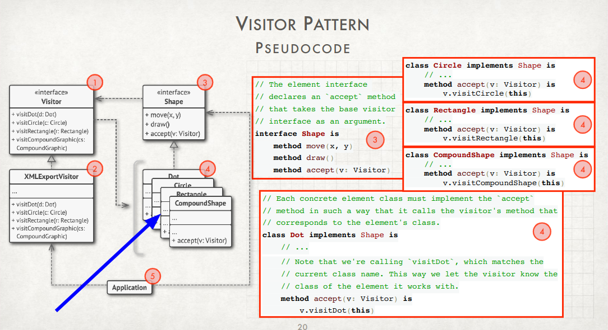

# kanvas

## Concept

Small MS-paint like utility that provides users with the ability to create
diagrams and drawings with ease.

The application will present the user with a canvas and various drawing tools.
Any of the drawing tools can be used to add detail to their canvas. For
example, there will be shapes that users can place onto their canvas, or they
can select a basic pen.

## Tentative Design Patterns

**Singleton**
Each of the applications UI elements will follow the singleton pattern. This
includes the single canvas and each of the available drawing tools

**Factory**
For each of the concrete shapes (triangle, square, etc.) that are available to
draw, they will all be created using a generic shape factory.

**Prototype**
For the ability to copy drawing tools, the protype pattern will be used.

**Bridge**
For the ability to draw a shape with the 'pen' and then having the application
convert it to a concrete shape, the bridge patten will be used.

**Command Pattern**
All command operations, like saving the current canvas, will use the command pattern.

**Iterator**
The canvas will contain numerous elements on it. To save the canvas, its
elements must be individually saves. To acheive this, the canvas will realize
the iterator pattern.

**Visitor**
We may want to implement the same operation on many of the elements, and each of these elements may require different
steps to achieve these operations. This could be employed when rendering images to the screen. This is kind of a worse
way to just use a member function, but whatever.

**Decorator**
The Compose Multi-platform SDK offers numerous decorators for their components.

**Command**
All of the applications commands, like save, undo, redo, etc. can use the Command pattern.

**Momento**

Use when implementing undo, redo, and possibly loading an existing project. Could be useful when saving the state of the
application.

## Contributing

### Pre-requisites

The [Kotlin tutorial](https://kotlinlang.org/docs/getting-started.html#learn-kotlin-fundamentals) only provides
instructions using the Intelli-J IDE, making it difficult to know what exactly is required. This would be tough for
headless environments, like CI. Nevertheless, the following is a semi-accurate list:

* Gradle (will be installed by Gradle Wrapper)
* For native applications (compiled to binary), [kotlin-native](https://kotlinlang.org/docs/native-overview.html) (compiler)
* For JVM applications, Java runtime environment (JRE), version 11

### 