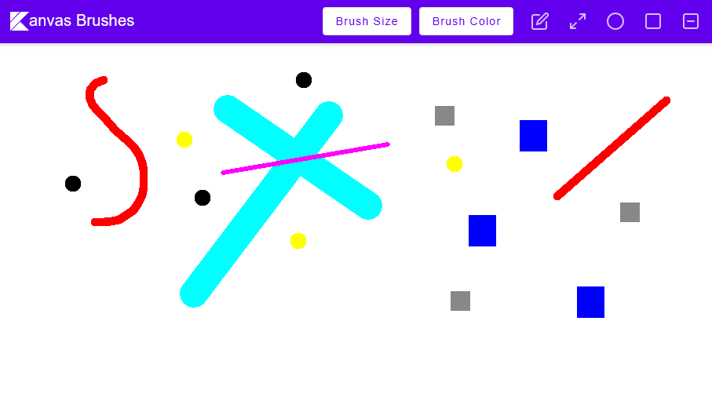

# Kanvas

Kanvas is a minimal Microsoft Paint like utility that provides users with the ability to easily draw lines and shapes of different colors and sizes. The application presents users with a blank white canvas and provides them with various drawing tools that can be used to add detail to their canvas.



## Getting Started

To run the program, head to the [release page](https://github.com/EthanG78/kanvas/releases) and download the latest JAR
artifact. This includes all dependencies to run on the JVM version 11 or greater. Then, run the program with Java. For example:

```bash
java -jar <download-location>/kanvas-1.0.jar
```

### Pre-requisites

The [Kotlin tutorial](https://kotlinlang.org/docs/getting-started.html#learn-kotlin-fundamentals) only provides
instructions using the Intelli-J IDE.
JetBrains' [Getting Started](https://github.com/JetBrains/compose-jb/tree/master/tutorials/Getting_Started) page for
compose is better. Nevertheless, the following is a semi-accurate list:

* Gradle (will be installed by Gradle Wrapper)
* For native applications (compiled to binary), [kotlin-native](https://kotlinlang.org/docs/native-overview.html) (compiler)
* For JVM applications, Java runtime environment (JRE), version 11

### Building with Gradle

1. Clone this repository
    ```bash
    git clone git@github.com:EthanG78/kanvas.git
    ```
2. Enter the project source tree
    ```bash
    cd kanvas
    ```
3. Build the fat Jar with Gradle. Gradle will automatically be installed using *gradlew*, the gradle wrapper. 
    ```bash
    ./gradlew jar 
    ```
   
4. Run the jar with java  
    ```bash
    java -jar build/libs/kanvas-1.0.jar
    ```
### Presentation
A presentation made by the authors of Kanvas can be found on Youtube [here](https://youtu.be/9xwezodGCM0). 

### Authors
- Justen Di Ruscio
- Ethan Garnier