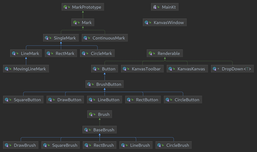
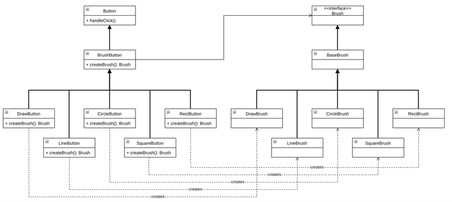
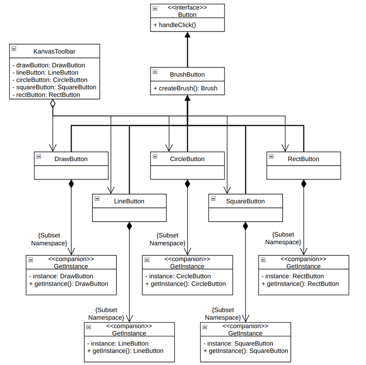
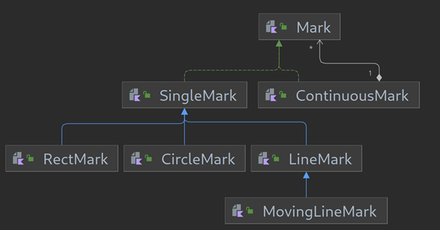
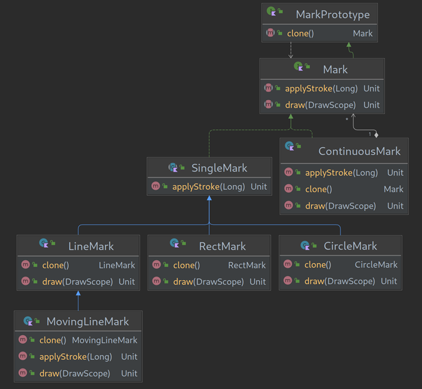

# Kanvas Data

This folder contains the UML diagrams that were constructed throughout development of Kanvas, as well as any screenshot or images used through the repo and its documents.

### First Iteration UML Diagram
The first iteration UML Diagram of Kanvas captures the planning stage of our development. This diagram was used as a foundation for our first commits to the project, as well as a guideline for what features we wanted to implement and what design patterns we were going to use to implement them. Some information portrayed within the diagram did not make it into the current version of Kanvas, as is reflected within our second iteration UML Diagram.

### Second Iteration UML Diagram
The second iteration UML Diagrams of Kanvas capture the current state of the project and represent the design patterns that have been employed in the software. These diagrams demonstrate the features currently implemented and what design patterns have been used to implement these features.

Below is a diagram that provides a class overview of our system. This diagram demonstrates how we designed Kanvas around interfaces.

Below is the UML diagram that describes our use of the Factory Creational Design Pattern when it came to different brushes as concrete products and the buttons that created those products.

Below is the UML diagram that describes our use of the Singleton Creational Design Pattern when it came to button UI elements only being able to have a single instance in the program.

Below is the UML diagram that describes our use of the Composite Structural Design Pattern when it came to the classification and handling of continuous and single marks on the canvas.

Below is the UML diagram that describes our use of the Prototype Creational Design Pattern when it came to cloning marks being added to a continuous mark collection.

### Authors
- Justen Di Ruscio
- Ethan Garnier