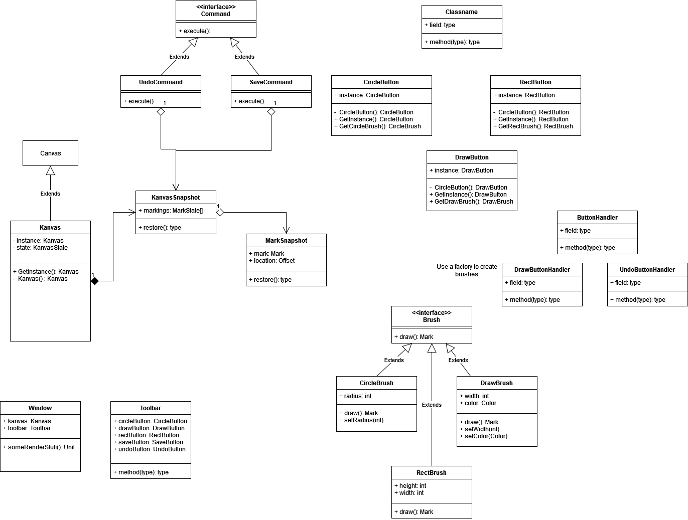

# Kanvas Data

This folder contains the UML diagrams that were constructed throughout development of Kanvas.

### First Iteration UML Diagram
The first iteration UML Diagram of Kanvas captures the planning stage of our development. This diagram was used as a foundation for our first commits to the project, as well as a guideline for what features we wanted to implement and what design patterns we were going to use to implement them. Some information portrayed within the diagram did not make it into the current version of Kanvas, as is reflected within our second iteration UML Diagram.

### Second Iteration UML Diagram
The second iteration UML Diagram of Kanvas captures the current state of the project. This diagram demonstrates the features currently implemented and what design patterns have been used to implement these features. It also captures how easily extendable the different features of Kanvas are, which is an intended design. This UML Diagram can be compared to our first iteration UML Diagram to see which features have been scraped between the planning phase and the current state of the software.

### Authors
- Justen Di Ruscio
- Ethan Garnier